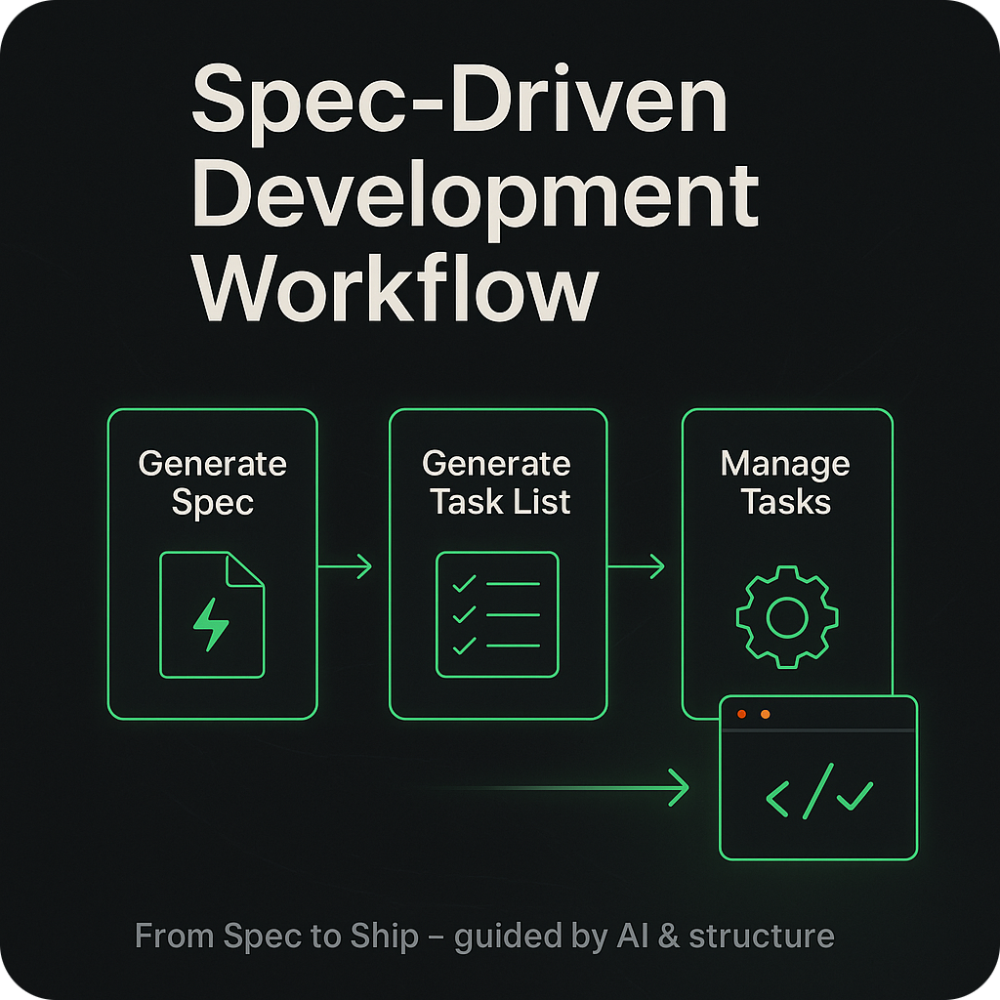
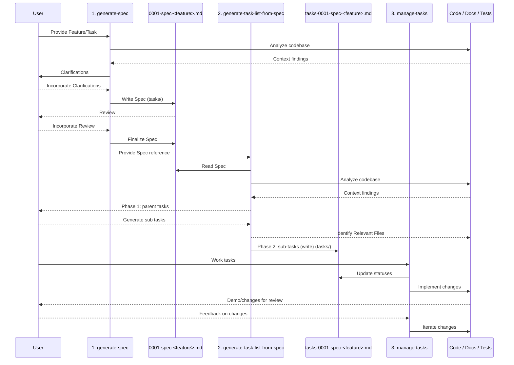

<div align="center">
    
    <h1>🧭 Spec-Driven Development Workflow</h1>
    <h3><em>Build predictable software with a repeatable AI-guided workflow.</em></h3>
</div>

<p align="center">
    <strong>Spec-driven development tools for collaborating with AI agents to deliver reliable outcomes.</strong>
</p>

<p align="center">
    <a href="https://github.com/liatrio-labs/spec-driven-workflow/actions/workflows/ci.yml"></a>
    <a href="https://github.com/liatrio-labs/spec-driven-workflow/blob/main/LICENSE"></a>
    <a href="https://github.com/liatrio-labs/spec-driven-workflow/stargazers"></a>
    <a href="docs/operations.md"></a>
</p>

## TLDR

1. Install the workflow prompts as slash commands in all your [local AI tools](#supported-ai-tools):

    ```bash
    uvx --from git+https://github.com/liatrio-labs/spec-driven-workflow sdd-generate-commands generate --yes
    ```

2. In your AI tool of choice, use `/generate-spec` with your idea:

    ```text
    /generate-spec I want to add user authentication to my app
    ```

    → AI asks clarifying questions → You provide answers → Spec created in `tasks/0001-spec-user-auth.md`

3. Continue the flow:

    - Run `/generate-task-list-from-spec` → Task list created in `tasks/tasks-0001-spec-user-auth.md`
    - Use `/manage-tasks` → Execute tasks one-by-one with proof artifacts

4. **SHIP IT** 🚢💨

## Highlights

- **Prompt-first workflow:** Use curated prompts to go from idea → spec → task list → implementation-ready backlog.
- **Predictable delivery:** Every step emphasizes demoable slices, proof artifacts, and collaboration with junior developers in mind.
- **Bonus MCP tooling:** Optionally pair the workflow with an MCP server for automation inside modern AI clients.

## Why Spec-Driven Development?

Spec-Driven Development (SDD) keeps AI collaborators and human developers aligned around a shared source of truth. This repository packages a lightweight, prompt-centric workflow that turns an idea into a reviewed specification, an actionable plan, and a disciplined execution loop. By centering on markdown artifacts instead of tooling, the workflow travels with you—across projects, models, and collaboration environments.

MCP technology remains available as an optional integration, but the heart of the project is the trio of prompts that guide teams from idea to demoable outcomes with consistent artifacts.

## Guiding Principles

- **Clarify intent before delivery:** The spec prompt enforces clarifying questions so requirements are explicit and junior-friendly.
- **Ship demoable slices:** Every stage pushes toward thin, end-to-end increments with clear demo criteria and proof artifacts.
- **Make work transparent:** Tasks live in versioned markdown files so stakeholders can review, comment, and adjust scope anytime.
- **Progress one slice at a time:** The management prompt enforces single-threaded execution to reduce churn and unfinished work-in-progress.
- **Stay automation ready:** While SDD works with plain Markdown, the prompts are structured for MCP, IDE agents, or other AI integrations.

## Prompt Workflow

All prompts live in `prompts/` and are designed for use inside your preferred AI assistant.

1. **`generate-spec`** (`prompts/generate-spec.md`): Ask clarifying questions, then author a junior-friendly spec with demoable slices.
2. **`generate-task-list-from-spec`** (`prompts/generate-task-list-from-spec.md`): Transform the approved spec into actionable parent tasks and sub-tasks with proof artifacts.
3. **`manage-tasks`** (`prompts/manage-tasks.md`): Coordinate execution, update task status, and record outcomes as you deliver value.

> Experimental: **`/boulder-dash`** (`prompts/boulder-dash.md`) is available when you want help exploring domain boundaries and slicing capabilities before kicking off the spec workflow. Use it opportunistically; it’s not required for the core flow.

Each prompt writes Markdown outputs into `tasks/`, giving you a lightweight backlog that is easy to review, share, and implement.

## How does it work?

The workflow is driven by Markdown prompts that function as reusable playbooks for the AI agent. Reference the prompts directly, or invoke them via supported tooling, to keep the AI focused on structured outcomes. Users can manage context with their existing workflows (GitHub CLI, Atlassian MCP, etc.), and optionally let the MCP server automate portions of the process.

## Workflow Overview

Three prompts in `/prompts` define the full lifecycle. Use them sequentially to move from concept to completed work.

### Stage 1 — Generate the Spec ([prompts/generate-spec.md](./prompts/generate-spec.md))

- Directs the AI assistant to use clarifying questions with the user before writing a Markdown spec.
- Produces `/tasks/000X-spec-<feature>.md` with goals, demoable units of work, functional/non-goals, metrics, and open questions.

### Stage 2 — Generate the Task List ([prompts/generate-task-list-from-spec.md](./prompts/generate-task-list-from-spec.md))

- Reads the approved spec, inspects the repo for context, and drafts parent tasks first.
- On confirmation from the user, expands each parent task into sequenced subtasks with demo criteria, proof artifacts, and relevant files.
- Outputs `/tasks/tasks-000X-spec-<feature>.md` ready for implementation.

### Stage 3 — Manage Tasks ([prompts/manage-tasks.md](./prompts/manage-tasks.md))

- Enforces disciplined execution: mark in-progress immediately, finish one subtask before starting the next, and log artifacts as you go.
- Bakes in commit hygiene, validation steps, and communication rituals so handoffs stay tight.

### Detailed SDD Workflow Diagram



## Core Artifacts

- **Specs:** `000X-spec-<feature>.md` — canonical requirements, demo slices, and success metrics.
- **Task Lists:** `tasks-000X-spec-<feature>.md` — parent/subtask checklist with relevant files and proof artifacts.
- **Status Keys:** `[ ]` not started, `[~]` in progress, `[x]` complete, mirroring the manage-tasks guidance.
- **Proof Artifacts:** URLs, CLI commands, screenshots, or tests captured per task to demonstrate working software.

## Hands-On Usage

The SDD workflow can be used in three ways, from simplest to most automated:

### Option 1: Manual Copy-Paste (No Tooling Required)

1. **Kick off a spec:** Copy or reference `prompts/generate-spec.md` inside your preferred AI chat. Provide the feature idea, answer the clarifying questions, and review the generated spec before saving it under `/tasks`.
2. **Plan the work:** Point the assistant to the new spec and walk through `prompts/generate-task-list-from-spec.md`. Approve parent tasks first, then request the detailed subtasks and relevant files. Commit the result to `/tasks`.
3. **Execute with discipline:** Follow `prompts/manage-tasks.md` while implementing. Update statuses as you work, attach proof artifacts, and pause for reviews at each demoable slice.

### Option 2: Native Slash Commands (Recommended)

#### Supported AI Tools

The slash command generator currently supports the following AI coding assistants:

| AI Tool      | Command Install Location                         |
|--------------|--------------------------------------------------|
| Claude Code  | `~/.claude/commands`                             |
| Codex CLI    | `~/.codex/prompts`                               |
| Cursor       | `~/.cursor/commands`                             |
| Gemini CLI   | `~/.gemini/commands`                             |
| VS Code      | `~/.config/Code/User/prompts`                    |
| Windsurf     | `~/.codeium/windsurf/global_workflows`           |

For full setup and agent-specific details, see [docs/slash-command-generator.md](./docs/slash-command-generator.md).

#### Slash Command Installation

Generate slash commands for your AI coding assistant and use the prompts as native commands:

```bash
# Clone and install locally
git clone https://github.com/liatrio-labs/spec-driven-workflow.git
cd spec-driven-workflow
uv sync
uv run sdd-generate-commands generate --yes

# Or run directly from the git repo via uvx
uvx --from git+https://github.com/liatrio-labs/spec-driven-workflow sdd-generate-commands generate --yes
```

This will auto-detect your configured AI assistants (Claude Code, Cursor, Windsurf, etc.) and generate command files in your home directory.

**Note**: Once available on PyPI, you'll be able to run `uvx spec-driven-development-mcp sdd-generate-commands generate --yes` for a one-liner installation.

See [docs/slash-command-generator.md](./docs/slash-command-generator.md) for details.

### Option 3: MCP Server (Advanced)

Run the prompts as an MCP server for programmatic access. This option is most useful for custom integrations and tools that support MCP.

> Note: MCP prompt support is not uniformly supported across AI tools. See [docs/mcp-prompt-support.md](./docs/mcp-prompt-support.md) for details.

### Workflow Essentials

1. Open `prompts/generate-spec.md` inside your AI assistant and follow the instructions to produce a new spec in `tasks/`.
2. Point the assistant at the generated spec and run `prompts/generate-task-list-from-spec.md` to create the implementation backlog.
3. Use `prompts/manage-tasks.md` while executing work to keep status, demo criteria, and proof artifacts up to date.

### Installation

```bash
# Clone the repository
git clone https://github.com/liatrio-labs/spec-driven-workflow.git
cd spec-driven-workflow

# Install dependencies
uv sync
```

### Run the MCP Server

**STDIO (local development):**

```bash
# From local clone
uvx fastmcp run server.py

# Or run directly from the git repo via uvx
uvx --from git+https://github.com/liatrio-labs/spec-driven-workflow spec-driven-development-mcp
```

**With MCP Inspector:**

```bash
uvx fastmcp dev server.py
```

**HTTP Transport:**

```bash
# Use fastmcp CLI for HTTP transport
uvx fastmcp run server.py --transport http --port 8000

# Or run directly from the git repo via uvx
uvx --from git+https://github.com/liatrio-labs/spec-driven-workflow spec-driven-development-mcp --transport http --port 8000
```

**Note**: Once available on PyPI, you'll be able to run `uvx spec-driven-development-mcp` for a one-liner installation with optional `--transport` and `--port` arguments. The `fastmcp run` approach remains available for development and advanced options.

See [docs/operations.md](docs/operations.md) and [CONTRIBUTING.md](CONTRIBUTING.md) for advanced configuration, deployment, and contribution guidelines.

## References

| Reference | Description | Link |
| --- | --- | --- |
| AI Dev Tasks | Foundational example of an SDD workflow expressed entirely in Markdown. | <https://github.com/snarktank/ai-dev-tasks> |
| MCP | Standard protocol for AI agent interoperability, used here as an optional integration layer. | <https://modelcontextprotocol.io/docs/getting-started/intro> |
| FastMCP | Python tooling for building MCP servers and clients that power this repo's automation. | <https://github.com/jlowin/fastmcp> |

## License

This project is licensed under the Apache License, Version 2.0. See the [LICENSE](LICENSE) file for details.
