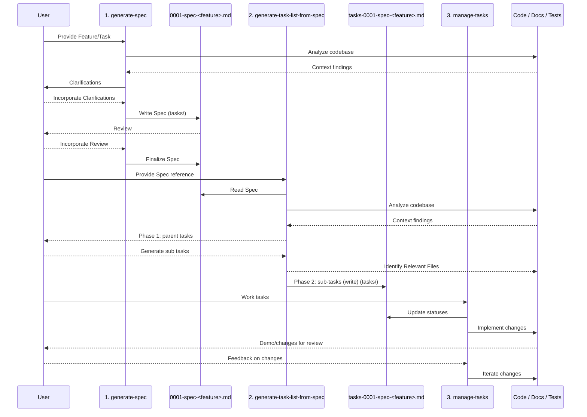

# Spec Driven Development (SDD) MCP

[](LICENSE)


## Why does this exist?

This project provides a ubiquitous framework for spec driven development (SDD) that can be used anywhere an AI agent is used as a collaborator.

MCP technology provides a standard way to represent and exchange information between AI agents, and this framework provides a way to use that information to guide the process of refining and implementing specifications of all kinds. Using MCP allows users to take advantage of the framework with whatever AI tool and AI model they choose, in whatever workflow they prefer.

## Goals

- **Simple:** Easy to use and understand with transparent access to the underlying tools and processes.
- **Ubiquitous:** Can be used anywhere an AI agent is used as a collaborator.
- **Reliable:** Reliable and can be trusted to deliver consistent results.
- **Flexible:** Can be used with any AI tool and AI model inside any workflow.
- **Scalable:** Can be used with any size of project.

Future functionality will include:

- User-defined output formats (Markdown task list, Jira objects via Atlassian MCP, GitHub issues, etc.)
- Ability to customize the prompts used to drive the SDD workflow
- TBD

## How does it work?

The MCP is driven by basic Markdown files that function as prompts for the AI agent. Users can reference the specific MCP tools in their prompts to use specific flows within the SDD workflow. Users can manage the context of the AI by using the tools of their existing workflows (GitHub CLI, Atlassian MCP, etc.). The AI agent can use the tools of the user's existing workflows to perform actions (e.g., create a new issue, update an existing issue, etc.)

### SDD Workflow Overview

Here is a detailed diagram of the SDD workflow:



### Available Prompts

The server provides three core prompts for spec-driven development:

- `generate-spec`: Create a detailed specification from a feature description
- `generate-task-list-from-spec`: Generate an actionable task list from a spec
- `manage-tasks`: Manage and track progress on task lists

## Technologies Used

| Technology | Description | Link |
| --- | --- | --- |
| `uv` | Modern Python package and project manager | <https://docs.astral.sh/uv/> |
| FastMCP | Tool for building MCP servers and clients | <https://github.com/jlowin/fastmcp> |
| `pre-commit` | Git hooks for code quality and formatting | <https://pre-commit.com/> |
| Semantic Release | Automated release process (via GitHub Actions) | <https://github.com/python-semantic-release/python-semantic-release> |

## Quick Start

### Installation

```bash
# Clone the repository
git clone https://github.com/liatrio/spec-driven-development-mcp.git
cd spec-driven-development-mcp

# Install dependencies
uv sync

# Run tests
uv run pytest
```

### Running the Server

**STDIO Transport (for local development):**

```bash
uvx fastmcp run server.py

# Or start an MCP Inspector instance for local testing along with the app:
uvx fastmcp dev server.py
```

**HTTP Transport (for remote access):**

```bash
uvx fastmcp run server.py --transport http --port 8000
```

See [docs/operations.md](docs/operations.md) and [CONTRIBUTING.md](CONTRIBUTING.md) for detailed configuration, contribution workflow, and deployment options.

## References

| Reference | Description | Link |
| --- | --- | --- |
| MCP | MCP is a standard way to represent and exchange information between AI agents | <https://modelcontextprotocol.io/docs/getting-started/intro> |
| FastMCP | The fast, Pythonic way to build MCP servers and clients. | <https://gofastmcp.com/getting-started/welcome> |
| AI Dev Tasks | Example of a basic SDD workflow using only markdown files. | <https://github.com/snarktank/ai-dev-tasks> |
| AI Dev Tasks (customized) | A customized version of AI Dev Tasks | <https://github.com/liatrio/read-me/tree/main/damien-storm/ai-stuff#feature-development-flow> |
| Spec Driven Workflow | Liatrio app that provides a unified development workflow system | <https://github.com/liatrio-labs/spec-driven-workflow> |

## License

This project is licensed under the Apache License, Version 2.0. See the
[LICENSE](LICENSE) file for details.
