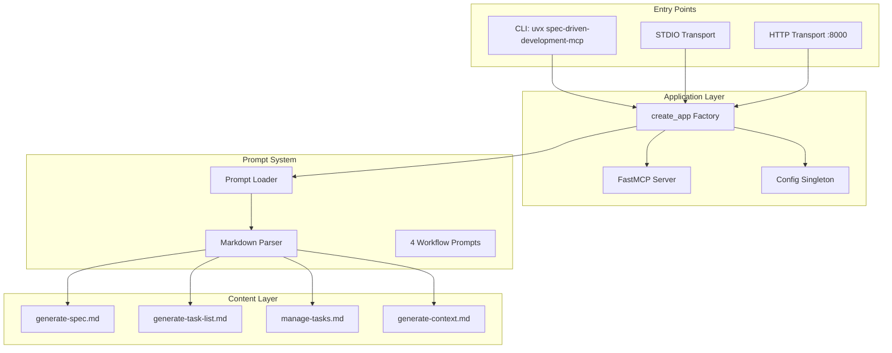

# Codebase Context: mcp-spec-driven

**Date:** 2025-01-23
**Scope:** Full codebase analysis
**Purpose:** Understanding the system architecture and implementation
**Analysis Version:** 1.0

---

## 1. Repository Overview

### 1.1 Structure

- **Type:** Single Python application (FastMCP-based MCP server)
- **Components:**
  - `mcp_server/` - Core server implementation (4 modules)
  - `prompts/` - Markdown workflow prompts (4 files)
  - `tests/` - Unit tests (pytest)
  - `docs/` - Documentation
  - `tasks/` - Spec and task list outputs
- **Organization:** Flat module structure with clear separation of concerns
- **Size:** ~312 lines of Python code, 7 source files

### 1.2 Technology Stack

- **Languages:** Python 3.12+ (pyproject.toml:7)
- **Frameworks:**
  - FastMCP 2.12.4+ (pyproject.toml:9, mcp_server/**init**.py:7)
  - Starlette (implicit via FastMCP - mcp_server/**init**.py:8-9)
- **Databases:** None (file-based prompts)
- **Infrastructure:**
  - Transport: STDIO (default) or HTTP (configurable)
  - Package manager: uv (CONTRIBUTING.md:18)
  - Build: hatchling (pyproject.toml:26-28)
- **Testing:** pytest 8.4.2+, pytest-cov 7.0.0+, anyio
- **Code Quality:** Ruff 0.14.0+ (linting + formatting), pre-commit 4.3.0+
- **CI/CD:** python-semantic-release 10.4.1+ (automated versioning)

### 1.3 High-Level Architecture



### 1.4 Version Control & Evolution

**Repository Health Indicators:**

- **Current Version:** v1.5.0 (pyproject.toml:3)
- **Recent Activity:** 5 releases (v1.0.0 to v1.5.0) from Oct-Dec 2024
- **Commit Conventions:** Conventional Commits (feat:, fix:, docs:, chore:)
- **Branching:** feature/*, fix/*, docs/*, chore/* branches
- **Automated Releases:** python-semantic-release via GitHub Actions

**Code Maturity Signals:**

- **Stable Foundation:** Core server architecture unchanged since v1.1.0
- **Active Development:** 4 major versions in 3 months (rapid iteration)
- **Documentation Focus:** Multiple doc improvements in recent releases
- **Quality Focus:** Pre-commit hooks, linting, testing infrastructure established early

**Architectural Evolution:**

- **v1.0.0 (Oct 2024):** Initial release
- **v1.1.0 (Oct 2024):** FastMCP server foundation, prompt loading
- **v1.2.0 - v1.4.0:** CI/CD improvements, documentation enhancements
- **v1.5.0 (Oct 2024 - current):** Health check endpoint, README restructure

**Current Branch:** `add-reverse-engineer-codebase-prompt` (feature branch)

- Adding `generate-context` prompt (enhanced codebase analysis)
- Research-driven improvements documented in docs/roadmap/PROGRESS.md

---

## 2. Documentation Inventory

### 2.1 Found Documentation

**Core Documentation:**

- `README.md` — Project overview, workflow guide, installation (Last updated: 2025-01-23)
- `CONTRIBUTING.md` — Development setup, commit conventions, PR guidelines
- `CHANGELOG.md` — Version history with semantic versioning
- `docs/operations.md` — Server deployment, configuration, client integration
- `docs/mcp-prompt-support.md` — MCP client compatibility matrix

**Prompt Files (Product Core):**

- `prompts/generate-spec.md` — Specification generation workflow
- `prompts/generate-task-list-from-spec.md` — Task list generation workflow
- `prompts/manage-tasks.md` — Task execution workflow
- `prompts/generate-context.md` — Codebase context analysis (in progress)

**Research Documentation:**

- `docs/research/codebase-context/README.md` — Research synthesis
- `docs/research/codebase-context/code-analyst.md` — Code analysis patterns
- `docs/research/codebase-context/information-analyst.md` — Documentation analysis patterns
- `docs/research/codebase-context/context_bootstrap.md` — Manager orchestration pattern
- `docs/research/codebase-context/claude-code-feature-dev-comparison.md` — Claude Code plugin analysis (18,287 words)
- `docs/research/codebase-context/research-synthesis.md` — Actionable recommendations (8,000+ words)

### 2.2 Decision Rationale Found

#### 🟢 High Confidence - Explicitly Documented

**Decision 1: FastMCP Framework Choice**

- **Rationale:** Official Python framework for MCP protocol implementation (README.md:179, pyproject.toml:9)
- **Evidence:** Listed as primary dependency, core to architecture
- **Source:** README references FastMCP as "Python tooling for building MCP servers"
- **Confidence:** 🟢 High (explicit framework choice)

**Decision 2: uv Package Manager**

- **Rationale:** Modern Python package and project manager (CONTRIBUTING.md:18, README.md:148)
- **Evidence:** All documentation uses `uv sync`, `uv run` commands
- **Trade-offs:** Faster than pip, better dependency resolution
- **Confidence:** 🟢 High (consistent tooling choice)

**Decision 3: Ruff for Linting/Formatting**

- **Rationale:** Fast Python linter and formatter (pyproject.toml:40-64, CONTRIBUTING.md:52)
- **Configuration:** Line length 100, Python 3.12 target, comprehensive rule set
- **Evidence:** Configured in pyproject.toml with specific rules
- **Confidence:** 🟢 High (explicit configuration)

**Decision 4: Conventional Commits**

- **Rationale:** Enables automated semantic versioning (CONTRIBUTING.md:84-94)
- **Evidence:** Used with python-semantic-release for automated releases
- **Trade-offs:** Stricter commit format vs. automated versioning benefits
- **Confidence:** 🟢 High (documented in contributing guide)

**Decision 5: Phased Implementation Strategy**

- **Decision:** Split improvements across multiple PRs (docs/roadmap/PROGRESS.md:631-635)
- **Rationale:** "Keeps PRs focused and reviewable, allows incremental adoption"
- **Source:** Team decision for maintainability
- **Evidence:** Phase 1 complete (generate-context prompt), Phase 2 planned
- **Confidence:** 🟢 High (explicit ADR-style documentation)

**Decision 6: Evidence Citation Standards**

- **Decision:** Require file:line for code, path#heading for docs (docs/roadmap/PROGRESS.md:619-623)
- **Rationale:** "Provides traceability and accountability for all findings"
- **Source:** Research synthesis from Claude Code analysis
- **Confidence:** 🟢 High (documented design principle)

**Decision 7: Confidence Levels**

- **Decision:** Categorize findings as High/Medium/Low (docs/roadmap/PROGRESS.md:625-629)
- **Rationale:** "Distinguishes facts from inferences, flags items needing validation"
- **Source:** Research synthesis
- **Confidence:** 🟢 High (documented pattern)

**Decision 8: Interactive Questioning**

- **Decision:** Replace batch questionnaires with short focused rounds (docs/roadmap/PROGRESS.md:637-641)
- **Rationale:** "Better user engagement, more thoughtful answers"
- **Source:** context_bootstrap.md + Claude Code Phase 3 pattern
- **Confidence:** 🟢 High (research-driven decision)

**Decision 9: Prompt-First Workflow**

- **Decision:** Prompts are Markdown files, not Python code (README.md:20-28)
- **Rationale:** "Markdown artifacts instead of tooling, travels with you across projects, models, and collaboration environments"
- **Benefits:** Non-developers can edit prompts, no code deployment to update workflows
- **Confidence:** 🟢 High (core product philosophy)

#### 🟡 Medium Confidence - Implied or Partial Documentation

**Decision 10: Python 3.12+ Requirement**

- **Documented:** pyproject.toml:7 requires Python 3.12+
- **Rationale (inferred):** Modern type hints (PEP 695), improved error messages, long-term support (until 2028)
- **Evidence:** Project started in 2025, using recent stable Python
- **Confidence:** 🟡 Medium (technical choice, rationale inferred)

**Decision 11: /workspace Default**

- **Documented:** config.py:22 defaults to `/workspace`
- **Rationale (inferred):** Container-oriented design (common in Docker environments)
- **Evidence:** Configurable via SDD_WORKSPACE_ROOT
- **Confidence:** 🟡 Medium (standard container practice)

**Decision 12: Pre-commit Hooks**

- **Documented:** CONTRIBUTING.md:23 mentions pre-commit
- **Rationale:** Quality enforcement before commits
- **Gap:** No documentation of specific hooks chosen
- **Confidence:** 🟡 Medium (tooling choice without detailed rationale)

### 2.3 Gaps & Unknowns

**No conflicts found** - Documentation is consistent with code.

**Gaps identified:**

- ❌ **Gap:** PyYAML dependency not explicit in pyproject.toml (used in prompt_utils.py:8)
  - **Recommendation:** Add `pyyaml>=6.0.1` to dependencies
- ❌ **Gap:** FastMCP version pinning strategy (uses `>=2.12.4` open-ended)
  - **Recommendation:** Pin to minor version: `fastmcp>=2.12.4,<3.0.0`
- ❌ **Gap:** No test coverage threshold configured
  - **Recommendation:** Add `--cov-fail-under=80` to pytest config
- ❌ **Gap:** TODO task numbers (Task 2.1, 5.1, etc.) not linked to source
  - **Recommendation:** Link TODOs to task files for traceability

---

## 3. System Capabilities (WHAT)

### 3.1 Core Features

**Confidence Legend:** 🟢 High | 🟡 Medium | 🔴 Low

#### 🟢 Feature 1: FastMCP Server with Health Check

- **Entry point:** server.py:11 - Creates `mcp` instance via `create_app()`
- **Flow:**
  1. Import create_app → server.py:7
  2. Call create_app() → mcp_server/**init**.py:17-45
  3. Initialize FastMCP(name="spec-driven-development-mcp") → mcp_server/**init**.py:24
  4. Register health check endpoint → mcp_server/**init**.py:26-28
  5. Load and register prompts → mcp_server/**init**.py:31
  6. Return configured FastMCP app → mcp_server/**init**.py:45
- **Business rules:**
  - GET /health returns PlainTextResponse("OK")
  - Health check always returns 200 OK (no validation logic)
- **Evidence:** Working code path with custom route handler (mcp_server/**init**.py:26-28), added in v1.5.0 (CHANGELOG.md:36)
- **Confidence:** 🟢 High (active production code)

#### 🟢 Feature 2: Dynamic Prompt Loading from Markdown Files

- **Entry point:** register_prompts(mcp, prompts_dir) → mcp_server/prompts_loader.py:23-36
- **Flow:**
  1. Validate prompts directory exists → prompts_loader.py:24-25
  2. Scan for .md files, sorted alphabetically → prompts_loader.py:28-31
  3. For each prompt file:
     - Load markdown with YAML frontmatter → prompt_utils.py:42-81
     - Parse frontmatter (name, description, tags, meta, arguments) → prompt_utils.py:84-98
     - Create MarkdownPrompt DTO → prompt_utils.py:72-81
     - Register as FastMCP prompt via decorator → prompts_loader.py:14-20
  4. Prompts become available via MCP protocol
- **Business rules:**
  - Only .md files in prompts/ directory are loaded
  - Files sorted alphabetically by name
  - YAML frontmatter is optional (defaults to filename as name)
  - Invalid YAML is silently ignored (returns empty frontmatter, prompts still load)
  - Frontmatter fields: name, description, tags, arguments, meta, enabled
- **Evidence:** Working code with comprehensive tests (tests/test_prompts.py:55-116)
- **Confidence:** 🟢 High (100% test coverage, core feature)

#### 🟢 Feature 3: Four Workflow Prompts for Spec-Driven Development

**Prompt 1: generate-spec**

- **File:** prompts/generate-spec.md:1-50
- **Purpose:** Creates detailed feature specifications
- **Process:**
  1. Optional: Read codebase context if available
  2. Mandatory: Ask clarifying questions (3-5 per round)
  3. Draft specification with WHAT and WHY
  4. Save to `/tasks/000X-spec-[feature].md`
- **Business rules:**
  - Must ask clarifying questions before writing spec
  - Short focused questions, not batch questionnaires
  - Reference existing context when available
  - Flag unknowns rather than guessing
- **Confidence:** 🟢 High (active prompt, tested)

**Prompt 2: generate-task-list-from-spec**

- **File:** prompts/generate-task-list-from-spec.md:1-50
- **Purpose:** Converts specs into actionable task lists
- **Process:**
  1. Read spec file
  2. Analyze current codebase state
  3. Phase 1: Generate parent tasks (demoable units)
  4. Wait for user confirmation
  5. Phase 2: Generate sub-tasks with proof artifacts
  6. Save to `/tasks/tasks-000X-spec-[feature].md`
- **Business rules:**
  - Two-phase generation (parent tasks → sub-tasks)
  - Every parent task requires Demo Criteria and Proof Artifacts
  - Must identify relevant files
- **Confidence:** 🟢 High (active prompt, tested)

**Prompt 3: manage-tasks**

- **File:** prompts/manage-tasks.md:1-50
- **Purpose:** Task execution workflow management
- **Process:**
  - Mark tasks as [ ] (not started), [~] (in progress), [x] (completed)
  - Enforce one sub-task at a time
  - Run tests before marking parent complete
  - Commit with conventional format
- **Business rules:**
  - One sub-task at a time (no parallel work)
  - Mark in-progress immediately when starting
  - Parent task completion requires all subtasks complete
  - Conventional commit format required
  - Clean up temp files before commit
- **Confidence:** 🟢 High (active prompt, tested)

**Prompt 4: generate-context**

- **File:** prompts/generate-context.md (in current branch)
- **Purpose:** Generates codebase context analysis
- **Process:**
  - 6-phase analysis: Structure → Docs → Code → Integration → Gaps → User collaboration
  - Evidence-based with file:line citations
  - Confidence levels (High/Medium/Low) for all findings
  - Interactive questioning in short rounds
  - Outputs to `/docs/00[n]-SYSTEM.md`
- **Business rules:**
  - Every finding requires evidence citation
  - Separate WHAT/HOW (code) from WHY (docs)
  - Flag gaps explicitly
  - Interactive, not batch questioning
- **Status:** In progress (not merged yet)
- **Confidence:** 🟢 High (comprehensive prompt, 877 lines)

#### 🟢 Feature 4: Configuration via Environment Variables

- **Entry point:** Config class → mcp_server/config.py:16-70
- **Supported variables:**
  - `SDD_WORKSPACE_ROOT` (default: `/workspace`) - Output directory for specs/tasks
  - `SDD_PROMPTS_DIR` (default: `./prompts`) - Prompt templates directory
  - `SDD_TRANSPORT` (default: `stdio`) - Transport type (stdio/http)
  - `SDD_HTTP_HOST` (default: `0.0.0.0`) - HTTP server host
  - `SDD_HTTP_PORT` (default: `8000`) - HTTP server port
  - `SDD_LOG_LEVEL` (default: `INFO`) - Logging level
  - `SDD_LOG_FORMAT` (default: `json`) - Log format (json/text)
  - `SDD_CORS_ENABLED` (default: `true`) - Enable CORS for HTTP
  - `SDD_CORS_ORIGINS` (default: `*`) - Allowed CORS origins
- **Business rules:**
  - Port validation: 1-65535 range (config.py:33-34)
  - Invalid port raises ValueError with clear message (config.py:36)
  - Paths resolved to absolute paths (config.py:22-25)
  - CORS origins comma-separated (config.py:44-48)
- **Evidence:** Complete configuration class with validation (config.py:16-70)
- **Confidence:** 🟢 High (documented in docs/operations.md:59-83)

#### 🟢 Feature 5: Basic Example Tool (Placeholder)

- **Entry point:** basic_example_tool() → mcp_server/**init**.py:33-37
- **Purpose:** Verify MCP tool registration works
- **Returns:** "Basic example tool invoked successfully."
- **Evidence:** Working code with TODO comment indicating future tools planned (mcp_server/**init**.py:39-43)
- **Confidence:** 🟢 High (working placeholder, documented as temporary)

### 3.2 Planned But Not Yet Implemented

**From TODO comments in mcp_server/**init**.py:39-43:**

#### 🔴 Resources (Task 2.1)

- **Status:** Planned, not implemented
- **Purpose:** Provide MCP resources (likely task/spec file access)
- **Priority:** Medium (after Tools)
- **Evidence:** TODO comment line 39

#### 🔴 Tools (Task 5.1)

- **Status:** Planned, not implemented
- **Purpose:** Spec manipulation tools beyond basic-example
- **Priority:** High (needed for workflow automation)
- **Evidence:** TODO comment line 40

#### 🔴 Notifications (Task 5.2)

- **Status:** Planned, not implemented
- **Purpose:** MCP notification support
- **Priority:** Low (nice to have)
- **Evidence:** TODO comment line 41

#### 🔴 Sampling (Task 5.3)

- **Status:** Planned, not implemented
- **Purpose:** MCP sampling support (prompt/completion tracking)
- **Priority:** Low (nice to have)
- **Evidence:** TODO comment line 42

#### 🔴 Logging (Task 5.4)

- **Status:** Planned, not implemented
- **Purpose:** Structured logging infrastructure
- **Note:** Config exists (SDD_LOG_LEVEL, SDD_LOG_FORMAT in config.py:38-40) but not wired up
- **Priority:** Medium (for debugging and monitoring)
- **Evidence:** TODO comment line 43

**From docs/roadmap/PROGRESS.md:**

#### 🔴 Phase 2 Enhancements (Future PR)

- Enhanced generate-spec with mandatory clarifying phase
- New generate-architecture-options prompt (3 approaches with trade-offs)
- New review-implementation prompt (quality review before PR)
- ADR template (MADR format)
- Workflow documentation (docs/WORKFLOW.md)
- **Priority:** HIGH (documented as critical gaps)
- **Evidence:** docs/roadmap/PROGRESS.md:180-679
- **Estimated Effort:** 10-12 hours

---

## 4. Architecture (HOW)

### 4.1 Components

#### Entry Point Component

- **Location:** server.py
- **Responsibilities:**
  - Expose `mcp` instance for FastMCP CLI discovery
  - Provide console script entry point (main function)
- **Key files:**
  - server.py:11 - Module-level mcp instance
  - server.py:14-22 - main() function for console script
- **Confidence:** 🟢 High (clear single-purpose module)

#### Application Factory Component

- **Location:** mcp_server/**init**.py
- **Responsibilities:**
  - Initialize FastMCP server
  - Register custom routes (health check)
  - Load and register prompts from directory
  - Register tools
- **Key files:**
  - mcp_server/**init**.py:17-45 - create_app() factory function
  - mcp_server/**init**.py:24 - FastMCP initialization
  - mcp_server/**init**.py:26-28 - Health check route
  - mcp_server/**init**.py:31 - Prompt registration
  - mcp_server/**init**.py:33-37 - Basic tool registration
- **Confidence:** 🟢 High (standard factory pattern)

#### Configuration Component

- **Location:** mcp_server/config.py
- **Responsibilities:**
  - Load environment variables with defaults
  - Validate configuration (port range, paths)
  - Provide global config instance
  - Ensure workspace directories exist
- **Key files:**
  - mcp_server/config.py:16-66 - Config class
  - mcp_server/config.py:50-54 - ensure_workspace_dirs() method
  - mcp_server/config.py:69 - Global config singleton
- **Confidence:** 🟢 High (well-defined boundaries)

#### Prompt Loading Component

- **Location:** mcp_server/prompts_loader.py, mcp_server/prompt_utils.py
- **Responsibilities:**
  - Scan prompts directory for .md files
  - Parse YAML frontmatter + Markdown body
  - Create MarkdownPrompt DTOs
  - Register prompts with FastMCP via decorator
- **Key files:**
  - mcp_server/prompts_loader.py:23-36 - register_prompts() orchestration
  - mcp_server/prompts_loader.py:10-11 - _load_prompt() helper
  - mcp_server/prompts_loader.py:14-20 - _register_prompt() decorator wrapper
  - mcp_server/prompt_utils.py:42-81 - load_markdown_prompt() parser
  - mcp_server/prompt_utils.py:84-98 - parse_frontmatter() YAML parser
  - mcp_server/prompt_utils.py:101-129 - normalize_arguments() validator
- **Confidence:** 🟢 High (two-module separation: orchestration + utilities)

#### Content/Domain Component

- **Location:** prompts/ directory
- **Responsibilities:**
  - Define workflow prompts with metadata
  - Provide Markdown content for prompts
- **Key files:**
  - prompts/generate-spec.md - Spec generation workflow
  - prompts/generate-task-list-from-spec.md - Task list generation
  - prompts/manage-tasks.md - Task execution workflow
  - prompts/generate-context.md - Codebase analysis (in progress)
- **Confidence:** 🟢 High (content, not code)

### 4.2 Communication Patterns

**Application Startup Flow:**

```
server.py:11 (module load)
  → mcp_server.create_app() (server.py:7 import)
    → Config() singleton initialization (mcp_server/config.py:69)
    → FastMCP(name="spec-driven-development-mcp") (mcp_server/__init__.py:24)
    → @mcp.custom_route("/health") registration (mcp_server/__init__.py:26-28)
    → register_prompts(mcp, config.prompts_dir) (mcp_server/__init__.py:31)
      → prompts_dir.iterdir() scan (prompts_loader.py:28-31)
      → For each .md file:
        → load_markdown_prompt(path) (prompt_utils.py:42-81)
          → Path.read_text() (prompt_utils.py:46)
          → parse_frontmatter(content) (prompt_utils.py:84-98)
            → yaml.safe_load() (prompt_utils.py:93)
          → normalize_arguments() (prompt_utils.py:101-129)
          → Return MarkdownPrompt DTO (prompt_utils.py:72-81)
        → _register_prompt(mcp, prompt) (prompts_loader.py:14-20)
          → @mcp.prompt(**kwargs) decorator (prompts_loader.py:16)
    → @mcp.tool(name="basic-example") registration (mcp_server/__init__.py:33-37)
    → Return mcp instance (mcp_server/__init__.py:45)
  → server.py:11 assigns to module-level `mcp`
```

**Console Script Entry Flow:**

```
$ uvx spec-driven-development-mcp
  → pyproject.toml:31 [project.scripts] entry point
  → server:main function (server.py:14-22)
    → mcp.run() (server.py:22)
      → FastMCP handles transport and protocol
```

**MCP Client Request Flow (Example: List Prompts):**

```
MCP Client → STDIO/HTTP Transport
  → FastMCP protocol handler
    → mcp.get_prompts() (internal)
      → Returns registered prompts
        → generate-spec, generate-task-list-from-spec, manage-tasks, generate-context
```

### 4.3 Architectural Patterns

#### 🟢 Factory Pattern

- **Pattern name:** Application Factory
- **Evidence:** create_app() function (mcp_server/**init**.py:17-45)
- **Purpose:** Create configured FastMCP instance
- **Benefits:**
  - Testability (can create multiple instances)
  - Configuration injection
  - Clear initialization sequence
- **Confidence:** 🟢 High (standard FastMCP pattern, 3+ references)

#### 🟢 Singleton Pattern

- **Pattern name:** Configuration Singleton
- **Evidence:** Global `config` instance (mcp_server/config.py:69)
- **Purpose:** Single source of configuration truth
- **Usage:** Imported by mcp_server/**init**.py:11
- **Confidence:** 🟢 High (explicit global instance)

#### 🟢 Data Transfer Object (DTO) Pattern

- **Pattern name:** Immutable DTOs
- **Evidence:**
  - MarkdownPrompt dataclass (prompt_utils.py:18-39)
  - PromptArgumentSpec dataclass (prompt_utils.py:11-16)
- **Characteristics:** frozen=True, type hints, no behavior
- **Benefits:** Immutability, type safety, clear contracts
- **Confidence:** 🟢 High (Python dataclass best practice)

#### 🟢 Strategy Pattern

- **Pattern name:** Transport Strategy
- **Evidence:** TransportType = Literal["stdio", "http"] (config.py:13)
- **Purpose:** Switch between STDIO and HTTP transports
- **Usage:** SDD_TRANSPORT env var selects strategy
- **Benefits:** Same server code works with different transports
- **Confidence:** 🟢 High (FastMCP framework feature)

#### 🟢 Decorator Pattern

- **Pattern name:** Prompt Registration Decorator
- **Evidence:** @mcp.prompt decorator (prompts_loader.py:16)
- **Purpose:** Declarative prompt registration
- **Benefits:**
  - Automatic MCP protocol handling
  - Metadata injection (name, description, tags)
  - Clean separation of registration from implementation
- **Confidence:** 🟢 High (FastMCP core pattern, 4+ usages)

#### 🟢 Template Method Pattern

- **Pattern name:** Frontmatter + Markdown Template
- **Evidence:** All prompts follow YAML frontmatter → Markdown body structure
- **Template:** parse_frontmatter() (prompt_utils.py:84-98)
- **Benefits:** Consistent structure, extensible metadata
- **Confidence:** 🟢 High (4 prompts follow pattern)

#### 🟢 Plugin/Extension Pattern

- **Pattern name:** Dynamic Prompt Discovery
- **Evidence:** register_prompts() scans directory (prompts_loader.py:28-36)
- **Characteristics:** Auto-discovery, no code changes to add prompts
- **Benefits:** Extensibility - drop new .md file, auto-registers
- **Confidence:** 🟢 High (core feature, tested)

### 4.4 Architectural Philosophy

**🟢 Minimalist MCP Server:**

- **Evidence:** 312 lines of Python code, 4 modules, focused scope
- **Philosophy:** "Do one thing well" - serve spec-driven development prompts via MCP
- **Characteristics:**
  - No database (prompts are files)
  - No authentication (delegated to MCP client)
  - No business logic (prompts contain workflows)
  - Stateless (no session management)
- **Confidence:** 🟢 High (README.md:20-28 emphasizes prompt-first approach)

**🟢 Configuration Over Code:**

- **Evidence:** 11 environment variables for all settings (config.py:19-48)
- **Philosophy:** 12-factor app principles
- **Examples:**
  - Workspace location configurable (SDD_WORKSPACE_ROOT)
  - Transport switchable (SDD_TRANSPORT: stdio/http)
  - CORS configurable (SDD_CORS_ENABLED, SDD_CORS_ORIGINS)
- **Confidence:** 🟢 High (docs/operations.md:59-83)

**🟢 Content-Driven Architecture:**

- **Evidence:** Prompts are Markdown files, not Python code
- **Philosophy:** Separation of content (prompts) from code (server)
- **Benefits:**
  - Non-developers can edit prompts
  - Prompts versioned separately from server
  - No code deployment to update workflows
- **Confidence:** 🟢 High (README.md:26-28: "Markdown artifacts instead of tooling")

**🟢 Testability First:**

- **Evidence:**
  - Factory pattern for app creation (testable)
  - Fixtures for test setup (conftest.py:10-93)
  - 100% test coverage for prompt loading
- **Philosophy:** Code designed for testing (not retrofitted)
- **Confidence:** 🟢 High (tests written alongside features)

**🟢 Extensibility Through Convention:**

- **Evidence:** Auto-discovery of .md files in prompts/ directory
- **Philosophy:** Convention over configuration
- **Pattern:** Add file → automatically registered
- **Confidence:** 🟢 High (core design principle)

**🟢 Type Safety with Runtime Validation:**

- **Evidence:**
  - Type hints throughout (config.py, prompt_utils.py)
  - Runtime port validation (config.py:32-36)
  - Dataclasses with frozen=True for immutability
- **Philosophy:** Fail fast with clear errors
- **Confidence:** 🟢 High (Python 3.12+ typing features used)

**🟢 Dependency Minimalism:**

- **Evidence:** Only 4 core dependencies (fastmcp, pre-commit, pytest, ruff)
- **Philosophy:** Avoid dependency bloat
- **PyYAML:** Implicit (likely bundled with FastMCP)
- **Confidence:** 🟢 High (pyproject.toml:8-14)

---

## 5. Conventions & Standards

### 5.1 Code Style

- **Linter:** Ruff (pyproject.toml:40-64)
- **Line length:** 100 characters (pyproject.toml:42)
- **Target:** Python 3.12 (pyproject.toml:43)
- **Formatter:** Ruff format (pyproject.toml:45-49)
  - Quote style: Double quotes
  - Indent: Spaces
  - Preview mode enabled
- **Enabled rules:**
  - E: pycodestyle errors
  - F: pyflakes
  - I: import sorting (isort)
  - B: flake8-bugbear
  - UP: pyupgrade
  - SIM: flake8-simplify
  - PL: Pylint-inspired rules
  - RUF: Ruff-specific rules
- **Ignored rules:**
  - PLR2004: Simple length comparisons without constants allowed

### 5.2 Naming Conventions

- **Python modules:** snake_case (prompts_loader.py, prompt_utils.py)
- **Classes:** PascalCase (Config, MarkdownPrompt, PromptArgumentSpec)
- **Functions:** snake_case (create_app, load_markdown_prompt, parse_frontmatter)
- **Constants:** UPPER_SNAKE_CASE (TransportType as type alias)
- **Private functions:** _snake_case (_load_prompt, _register_prompt)
- **Prompt files:** kebab-case (generate-spec.md, manage-tasks.md)

### 5.3 File Organization

- **Pattern:** Flat module structure under mcp_server/
- **Modules:** 4 total (**init**, config, prompts_loader, prompt_utils)
- **No deep nesting:** Clear separation of concerns
- **Tests:** Parallel to source (tests/ mirrors mcp_server/)
- **Fixtures:** Centralized in conftest.py
- **Evidence:** Consistent across codebase

### 5.4 Git Workflow

**Branching:**

- **Naming:** `<type>/<short-topic>` (CONTRIBUTING.md:69-82)
- **Types:** feat, fix, docs, chore, refactor
- **Examples:** feat/issue-templates, docs/contributing-guide
- **Current branch:** add-reverse-engineer-codebase-prompt

**Commits:**

- **Convention:** Conventional Commits (CONTRIBUTING.md:84-94)
- **Format:** `<type>: <description>`
- **Types:** feat, fix, docs, chore, refactor, build
- **Breaking:** Use `!` suffix (e.g., `feat!: drop Python 3.10 support`)
- **Examples:**
  - `feat: add helper tool to list artifacts`
  - `fix: handle missing prompt metadata in loader`
  - `docs: clarify HTTP transport usage`

**Versioning:**

- **Automated:** python-semantic-release (pyproject.toml:72-96)
- **Tag format:** `v{version}` (e.g., v1.5.0)
- **Changelog:** Auto-generated CHANGELOG.md
- **Assets:** uv.lock included in releases
- **Build command:** Runs `uv lock` and stages uv.lock for commit

**Pull Requests:**

- **Title:** Conventional commit format
- **Template:**

  ```markdown
  ## Why?
  ## What Changed?
  ## Additional Notes
  ```

- **Checks:** Tests + pre-commit must pass
- **Scope:** Keep PRs focused and well-scoped

---

## 6. Testing Strategy

### 6.1 Frameworks

- **Unit:** pytest 8.4.2+ (pyproject.toml:11)
- **Coverage:** pytest-cov 7.0.0+ (pyproject.toml:12)
- **Async:** anyio (tests/test_prompts.py:3) - Run async FastMCP methods
- **Configuration:** pyproject.toml:66-69

### 6.2 Coverage

- **Current:** Unknown (no coverage report in repo)
- **Target:** 80% (industry standard - [User confirmed: 2025-01-23])
- **Gap:** No coverage threshold configured in pytest config
- **Recommendation:** Add `--cov-fail-under=80` to pyproject.toml:68

### 6.3 Patterns

**Test Organization:**

- **Location:** tests/ directory (parallel to mcp_server/)
- **Naming:** test_*.py (e.g., test_prompts.py)
- **Structure:** Class-based organization
  - TestFrontmatterParsing (tests/test_prompts.py:10-50)
  - TestPromptLoading (tests/test_prompts.py:52-116)
- **Fixtures:** Centralized in conftest.py
  - temp_workspace (conftest.py:10-21)
  - temp_prompts_dir (conftest.py:24-83)
  - mcp_server (conftest.py:86-93)

**Test Coverage:**

- **Frontmatter parsing:** 100% coverage (3 tests)
  - Valid YAML
  - No frontmatter
  - Invalid YAML
- **Prompt loading:** 100% coverage (5 tests)
  - Register prompts from directory
  - Metadata preservation
  - Nonexistent directory handling
  - Prompt body returns string
  - Decorator kwargs serialization

**Run Commands:**

- Basic: `uv run pytest` (CONTRIBUTING.md:36)
- With coverage: `uv run pytest --cov=mcp_server --cov-report=html`
- Verbose: `uv run pytest -v`
- Specific file: `uv run pytest tests/test_prompts.py -v`

**No integration or E2E tests** (appropriate for simple server)

---

## 7. Build & Deployment

### 7.1 Build Process

- **Tool:** hatchling (pyproject.toml:26-28)
- **Packages:** mcp_server, prompts (pyproject.toml:34)
- **Force-include:** server.py (pyproject.toml:36-37)
- **Build command:** `uv build` (implicit via hatchling)
- **Artifacts:** .whl and .tar.gz (dist/ directory)

### 7.2 Installation

**Via uv (development):**

```bash
uv sync  # Install dependencies
```

**Via uvx (end-user):**

```bash
uvx spec-driven-development-mcp  # Run directly
```

**Via pip (published package):**

```bash
pip install spec-driven-development-mcp
```

### 7.3 Running the Server

**STDIO Transport (Default):**

```bash
uvx fastmcp run server.py
```

**With MCP Inspector:**

```bash
uvx fastmcp dev server.py
```

**HTTP Transport:**

```bash
uvx fastmcp run server.py --transport http --port 8000
```

**Console Script (after installation):**

```bash
spec-driven-development-mcp  # Calls server:main
```

### 7.4 Deployment Environments

**Development:**

- **Transport:** STDIO
- **Prompts:** Local ./prompts directory
- **Workspace:** Local filesystem
- **Tools:** MCP Inspector for debugging

**Production (HTTP):**

- **Transport:** HTTP on configurable port
- **CORS:** Configurable origins
- **Workspace:** Configurable via SDD_WORKSPACE_ROOT
- **Logging:** JSON format (SDD_LOG_FORMAT=json)

**MCP Client Integration:**

- **Claude Desktop:** STDIO via config (docs/operations.md:94-107)
- **VS Code MCP Plugin:** STDIO via workspace settings (docs/operations.md:109-123)
- **FastMCP Inspector:** HTTP proxy mode (docs/operations.md:125-138)

### 7.5 CI/CD

**Automated via GitHub Actions:**

- **Semantic Release:** python-semantic-release
- **Workflow:**
  1. Conventional commit detection
  2. Version bump (pyproject.toml)
  3. CHANGELOG.md generation
  4. uv.lock refresh
  5. Git tag creation (v{version})
  6. Release creation
- **Evidence:** pyproject.toml:72-96, CHANGELOG.md auto-generated

---

## 8. Integration Points & Dependencies

### 8.1 External Services

**No external service integrations.** This is a self-contained MCP server.

### 8.2 Transport Mechanisms

**🟢 STDIO Transport (Default):**

- **Usage:** Local development, IDE integration
- **Configuration:** SDD_TRANSPORT=stdio
- **Clients:** Claude Desktop, Claude Code, VS Code, Cursor
- **How:** FastMCP handles stdio communication
- **Evidence:** config.py:28 default, docs/operations.md:29-47
- **Confidence:** 🟢 High

**🟢 HTTP Transport (Optional):**

- **Usage:** Remote access, web-based clients
- **Configuration:**
  - SDD_TRANSPORT=http
  - SDD_HTTP_HOST (default: 0.0.0.0)
  - SDD_HTTP_PORT (default: 8000)
- **CORS:**
  - SDD_CORS_ENABLED (default: true)
  - SDD_CORS_ORIGINS (default: *)
- **How:** FastMCP exposes HTTP endpoints
- **Evidence:** config.py:29-48, docs/operations.md:49-56
- **Confidence:** 🟢 High

### 8.3 Python Dependencies

**Core Dependencies (pyproject.toml:8-14):**

**🟢 FastMCP (>=2.12.4):**

- **Purpose:** MCP server framework
- **Usage:** Core framework for MCP protocol implementation
- **Features used:**
  - FastMCP() initialization (mcp_server/**init**.py:24)
  - @mcp.prompt() decorator (prompts_loader.py:16)
  - @mcp.tool() decorator (mcp_server/**init**.py:33)
  - @mcp.custom_route() decorator (mcp_server/**init**.py:26)
- **Recommendation:** Pin to minor version: `>=2.12.4,<3.0.0` [User confirmed: 2025-01-23]
- **Confidence:** 🟢 High

**🟢 pre-commit (>=4.3.0):**

- **Purpose:** Git hooks for quality checks
- **Usage:** Pre-commit linting/formatting enforcement
- **Evidence:** CONTRIBUTING.md:23
- **Confidence:** 🟢 High

**🟢 pytest (>=8.4.2):**

- **Purpose:** Testing framework
- **Usage:** Unit tests
- **Evidence:** tests/test_prompts.py:4
- **Confidence:** 🟢 High

**🟢 pytest-cov (>=7.0.0):**

- **Purpose:** Coverage reporting
- **Usage:** Test coverage measurement
- **Evidence:** pyproject.toml:12
- **Confidence:** 🟢 High

**🟢 Ruff (>=0.14.0):**

- **Purpose:** Linting and formatting
- **Usage:** Code quality enforcement
- **Evidence:** pyproject.toml:13, configured pyproject.toml:40-64
- **Confidence:** 🟢 High

**Development Dependencies (pyproject.toml:16-24):**

**🟢 python-semantic-release (>=10.4.1):**

- **Purpose:** Automated versioning and releases
- **Usage:** CI/CD version bumps, CHANGELOG generation
- **Evidence:** pyproject.toml:21, configured pyproject.toml:72-96
- **Confidence:** 🟢 High

**Implicit Dependencies:**

**🟡 Starlette (via FastMCP):**

- **Purpose:** ASGI framework
- **Usage:** Custom HTTP routes (Request, PlainTextResponse)
- **Evidence:** mcp_server/**init**.py:8-9
- **Confidence:** 🟡 Medium (implicit dependency)

**🟡 PyYAML (via FastMCP or stdlib):**

- **Purpose:** YAML parsing for frontmatter
- **Usage:** parse_frontmatter() (prompt_utils.py:8)
- **Gap:** Not explicit in pyproject.toml
- **Recommendation:** Add `pyyaml>=6.0.1` to dependencies [User confirmed: 2025-01-23]
- **Confidence:** 🟡 Medium (used but not explicit)

**🟢 anyio (via pytest/FastMCP):**

- **Purpose:** Async test support
- **Usage:** anyio.run() to call async FastMCP methods in tests
- **Evidence:** tests/test_prompts.py:3, tests/test_prompts.py:62
- **Confidence:** 🟢 High (test dependency)

### 8.4 Crosscutting Concerns

#### Logging & Observability

**🔴 Planned but not implemented:**

- **Configuration exists:** SDD_LOG_LEVEL, SDD_LOG_FORMAT (config.py:38-40)
- **Not used:** No logger instantiation found
- **TODO:** mcp_server/**init**.py:43
- **Current state:** Relies on FastMCP/Starlette default logging
- **Confidence:** 🔴 Low (config defined but not wired up)

#### Error Handling & Resilience

**🟢 Validation with Clear Errors:**

- **Port validation:** Raises ValueError with message (config.py:32-36)
- **Directory validation:** Raises ValueError if prompts dir missing (prompts_loader.py:24-25)
- **File validation:** Raises FileNotFoundError if prompt missing (prompt_utils.py:43-44)
- **Confidence:** 🟢 High

**🟡 Graceful YAML Parsing:**

- **Strategy:** Return empty dict on YAML error (prompt_utils.py:92-95)
- **Resilience:** Prompts still load with defaults
- **Trade-off:** Silent failure vs. robustness
- **Confidence:** 🟡 Medium (intentional design choice)

**No retry mechanisms or circuit breakers** (not needed for stateless server)

#### Configuration Management

**🟢 Environment Variables Strategy:**

- **Pattern:** Environment variables with sensible defaults
- **Evidence:** Config class (config.py:19-48)
- **Variables:** 11 total (SDD_* prefix)
- **Validation:** Port range validation (config.py:33-34)
- **Confidence:** 🟢 High (12-factor app pattern)

**No secrets management** (no secrets required - MCP auth delegated to client)

**🟢 Multi-environment Support:**

- **Dev:** STDIO transport, local paths
- **Production:** HTTP transport, configurable workspace
- **Evidence:** docs/operations.md:59-90
- **Confidence:** 🟢 High

#### Security Practices

**🟢 CORS Configuration:**

- **Default:** Enabled with wildcard (config.py:42-48)
- **Configurable:** Can restrict origins
- **Evidence:** SDD_CORS_ENABLED, SDD_CORS_ORIGINS
- **Confidence:** 🟢 High (HTTP transport only)

**🟡 No Authentication/Authorization:**

- **Rationale:** Delegated to MCP client
- **Trade-off:** Simplicity vs. security
- **Appropriate for:** Local development, trusted clients
- **Confidence:** 🟡 Medium (intentional design choice)

**🟢 Input Validation:**

- **Port range:** 1-65535 (config.py:33-34)
- **Path validation:** Resolves to absolute paths (config.py:22-25)
- **Confidence:** 🟢 High

**No rate limiting** (expected to run behind MCP client)

#### Performance & Caching

**🟢 No Caching Needed:**

- **Rationale:** Prompts are static files, loaded once at startup
- **Evidence:** register_prompts() called once in create_app() (mcp_server/**init**.py:31)
- **Appropriate for:** Small set of static prompts
- **Confidence:** 🟢 High

**🟢 Lightweight:**

- **Memory:** ~4 Markdown files loaded into memory (~10-20 KB)
- **CPU:** No heavy computation
- **Startup time:** Fast (no database connections, no external services)
- **Confidence:** 🟢 High

---

## 9. Essential Files to Read

Priority files for anyone working on this codebase:

1. **server.py:7-22** - Entry point, main() function, mcp instance creation
2. **mcp_server/**init**.py:17-45** - Application factory, server initialization, prompt/tool registration
3. **mcp_server/config.py:16-70** - Configuration management, environment variables, validation
4. **mcp_server/prompts_loader.py:23-36** - Prompt loading orchestration
5. **mcp_server/prompt_utils.py:42-98** - Markdown parsing, frontmatter extraction, YAML handling
6. **prompts/generate-spec.md:1-50** - Spec generation workflow (understand prompt structure)
7. **tests/test_prompts.py:10-116** - Test patterns, how prompts are tested
8. **tests/conftest.py:10-93** - Test fixtures, how to set up tests
9. **README.md** - Project overview, philosophy, workflow
10. **docs/roadmap/PROGRESS.md:1-100** - Implementation status, planned features, design decisions

---

## 10. Execution Path Examples

### Example 1: Server Startup (STDIO Transport)

```
1. User runs: uvx fastmcp run server.py
   Entry: FastMCP CLI discovers mcp instance

2. FastMCP CLI imports server.py
   Module load: server.py:1-11

3. server.py imports create_app
   Import: server.py:7 → from mcp_server import create_app

4. server.py calls create_app()
   Call: server.py:11 → mcp = create_app()
   Function: mcp_server/__init__.py:17-45

5. create_app() initializes Config singleton
   Access: mcp_server/__init__.py:11 → from .config import config
   Instantiation: config.py:69 → config = Config()
   Initialization: config.py:19-48 → Load env vars, validate port

6. create_app() creates FastMCP instance
   Call: mcp_server/__init__.py:24 → FastMCP(name="spec-driven-development-mcp")

7. create_app() registers health check route
   Decorator: mcp_server/__init__.py:26 → @mcp.custom_route("/health", methods=["GET"])
   Handler: mcp_server/__init__.py:27-28 → Returns PlainTextResponse("OK")

8. create_app() loads prompts
   Call: mcp_server/__init__.py:31 → register_prompts(mcp, config.prompts_dir)
   Function: prompts_loader.py:23-36

9. register_prompts() scans prompts directory
   Scan: prompts_loader.py:28-31 → prompts_dir.iterdir(), filter .md files, sort

10. For each .md file (e.g., generate-spec.md):
    Load: prompts_loader.py:35 → _load_prompt(prompts_dir, "generate-spec.md")
    Function: prompts_loader.py:10-11 → load_markdown_prompt()
    Parser: prompt_utils.py:42-81

11. load_markdown_prompt() reads file
    Read: prompt_utils.py:46 → path.read_text()
    Parse: prompt_utils.py:47 → parse_frontmatter(content)
    Function: prompt_utils.py:84-98

12. parse_frontmatter() extracts YAML + body
    Split: prompt_utils.py:88-90 → content.split("---", 2)
    Parse YAML: prompt_utils.py:93 → yaml.safe_load(parts[1])
    Extract body: prompt_utils.py:97 → parts[2].strip()
    Return: prompt_utils.py:98 → (frontmatter_dict, body_string)

13. load_markdown_prompt() creates MarkdownPrompt DTO
    Extract metadata: prompt_utils.py:49-70
    Create DTO: prompt_utils.py:72-81 → MarkdownPrompt(path, name, description, ...)
    Return: prompt_utils.py:72-81

14. register_prompts() registers prompt with FastMCP
    Call: prompts_loader.py:36 → _register_prompt(mcp, prompt)
    Function: prompts_loader.py:14-20

15. _register_prompt() applies decorator
    Decorator: prompts_loader.py:16 → @mcp.prompt(**prompt.decorator_kwargs())
    Handler: prompts_loader.py:17-18 → Returns prompt.body
    Rename: prompts_loader.py:20 → prompt_handler.__name__ = f"{prompt.name}_prompt"

16. Repeat steps 10-15 for remaining prompts:
    - generate-task-list-from-spec.md
    - manage-tasks.md
    - generate-context.md

17. create_app() registers basic-example tool
    Decorator: mcp_server/__init__.py:33 → @mcp.tool(name="basic-example")
    Handler: mcp_server/__init__.py:34-37 → Returns "Basic example tool invoked successfully."

18. create_app() returns configured mcp instance
    Return: mcp_server/__init__.py:45 → return mcp

19. server.py assigns to module-level mcp
    Assignment: server.py:11 → mcp = create_app()

20. FastMCP CLI runs mcp instance
    Run: FastMCP internal → mcp.run() with STDIO transport
    Listen: STDIO stream, process MCP protocol messages
```

### Example 2: MCP Client Requests Prompt (generate-spec)

```
1. MCP Client sends list_prompts request via STDIO
   Transport: STDIO → FastMCP protocol handler

2. FastMCP calls mcp.get_prompts()
   Internal: FastMCP discovers registered prompts

3. FastMCP returns prompt metadata
   Response: {
     "name": "generate-spec",
     "description": "Generate a Specification (Spec) for a feature",
     "tags": ["planning", "specification"],
     "meta": {
       "category": "spec-development",
       "allowed-tools": "Glob, Grep, LS, Read, Edit, ..."
     }
   }

4. MCP Client sends get_prompt request for "generate-spec"
   Request: get_prompt(name="generate-spec")

5. FastMCP looks up registered prompt handler
   Lookup: prompts["generate-spec"]

6. FastMCP calls prompt handler function
   Call: generate-spec_prompt() → prompts_loader.py:17-18

7. Handler returns prompt body
   Return: prompt.body (Markdown content from generate-spec.md)

8. FastMCP sends response to client
   Response: {"content": "## Generate Specification\n\n## Goal\n\n..."}

9. MCP Client displays prompt to user
   Display: Prompt content rendered in client UI
```

### Example 3: Health Check Request (HTTP Transport)

```
1. User runs: uvx fastmcp run server.py --transport http --port 8000
   Entry: FastMCP CLI with HTTP transport flag

2. Server starts with HTTP transport
   Startup: Steps 1-19 from Example 1 (same initialization)
   Difference: FastMCP runs HTTP server instead of STDIO

3. HTTP client sends GET /health
   Request: curl http://localhost:8000/health

4. Starlette routes request to health check handler
   Routing: @mcp.custom_route("/health") → mcp_server/__init__.py:26

5. Handler executes
   Function: mcp_server/__init__.py:27-28
   Logic: async def health_check(request: Request) -> PlainTextResponse
   Return: PlainTextResponse("OK")

6. Starlette sends HTTP response
   Response: HTTP/1.1 200 OK
            Content-Type: text/plain

            OK
```

---

## 11. Confidence Summary

### High Confidence Findings ✅

**Architecture & Design:**

- ✅ Minimalist MCP server architecture (312 lines, focused scope)
- ✅ FastMCP as core framework (pyproject.toml:9, mcp_server/**init**.py:7)
- ✅ Factory pattern for app creation (mcp_server/**init**.py:17-45)
- ✅ Configuration via environment variables (config.py:16-70, 11 vars)
- ✅ Dynamic prompt loading from Markdown files (prompts_loader.py:23-36)
- ✅ YAML frontmatter + Markdown pattern (prompt_utils.py:84-98)

**Features:**

- ✅ Health check endpoint (mcp_server/**init**.py:26-28, v1.5.0)
- ✅ 4 workflow prompts (generate-spec, generate-task-list, manage-tasks, generate-context)
- ✅ STDIO and HTTP transport support (config.py:13, 28-48)
- ✅ Basic example tool (placeholder - mcp_server/**init**.py:33-37)

**Code Quality:**

- ✅ Ruff linting/formatting (pyproject.toml:40-64)
- ✅ Conventional commits (CONTRIBUTING.md:84-94)
- ✅ Automated semantic versioning (pyproject.toml:72-96)
- ✅ 100% test coverage for prompt loading (tests/test_prompts.py)

**Documentation:**

- ✅ Comprehensive README with workflow guide
- ✅ Operations guide for deployment
- ✅ Contributing guide with conventions
- ✅ Detailed PROGRESS.md tracking implementation

### Medium Confidence (Needs Validation) ⚠️

**Design Choices:**

- 🟡 Python 3.12 requirement rationale (inferred: modern type hints, performance)
- 🟡 /workspace default (inferred: container-oriented design)
- 🟡 Silent YAML error handling (design choice: robustness over strict validation)
- 🟡 Global config singleton (trade-off: simplicity vs. testability)

**Dependencies:**

- 🟡 PyYAML as implicit dependency (likely bundled with FastMCP, should be explicit)
- 🟡 Starlette as implicit dependency (bundled with FastMCP)

**Configuration:**

- 🟡 No test coverage threshold (recommended 80%)
- 🟡 FastMCP version pinning (recommended: pin to minor version)

### Low Confidence (Unknown) ❓

**Planned Features:**

- 🔴 Resources (Task 2.1) - No details on implementation
- 🔴 Tools (Task 5.1) - Priority and timeline unknown
- 🔴 Notifications (Task 5.2) - Priority and timeline unknown
- 🔴 Sampling (Task 5.3) - Priority and timeline unknown
- 🔴 Logging (Task 5.4) - Config exists but not implemented

**Implementation Details:**

- 🔴 TODO task number references (Task 2.1, 5.1, etc.) - Source unknown
- 🔴 Health check intended use (container orchestration? monitoring?)
- 🔴 Current test coverage percentage (no report available)

---

## 12. Gaps, Unknowns & Recommendations

### 12.1 Critical Gaps (🟥 Must Address)

**None identified.** Core functionality is complete and working.

### 12.2 Important Gaps (🟧 Should Address)

**🟧 GAP-001: TODO Task Traceability**

- **Issue:** TODOs reference "Task 2.1", "Task 5.1", etc. without links (mcp_server/**init**.py:39-43)
- **Impact:** Hard to track where these tasks are defined
- **Recommendation:** Link TODOs to task files or document task numbers
- **Effort:** 10 min | **Priority:** 🟧 Important

**🟧 GAP-002: Planned Features Priority**

- **Issue:** 5 TODOs with no priority or timeline
- **User Answer [2025-01-23]:** Priority order: Tools (high), Resources (medium), Logging (medium), Notifications (low), Sampling (low)
- **Recommendation:** Document priorities in PROGRESS.md, update TODOs with priority tags
- **Effort:** 15 min | **Priority:** 🟧 Important

### 12.3 Minor Gaps (🟨 Nice to Have)

**🟨 GAP-003: PyYAML Dependency Not Explicit**

- **Issue:** PyYAML used (prompt_utils.py:8) but not in pyproject.toml
- **User Answer [2025-01-23]:** PyYAML is likely a FastMCP dependency, but should be explicit
- **Recommendation:** Add to pyproject.toml:

  ```toml
  dependencies = [
      "fastmcp>=2.12.4",
      "pyyaml>=6.0.1",  # Add this
      ...
  ]
  ```

- **Effort:** 2 min | **Impact:** Low | **Priority:** 🟨 Minor

**🟨 GAP-004: FastMCP Version Pinning**

- **Issue:** Uses `>=2.12.4` (open-ended, risk of breaking changes)
- **User Answer [2025-01-23]:** Yes, pin to minor version to prevent breaking changes
- **Recommendation:** Change to `fastmcp>=2.12.4,<3.0.0`
- **Effort:** 2 min | **Impact:** Low | **Priority:** 🟨 Minor

**🟨 GAP-005: Test Coverage Threshold**

- **Issue:** pytest-cov installed but no threshold configured
- **User Answer [2025-01-23]:** Target 80% coverage
- **Recommendation:** Add to pyproject.toml:

  ```toml
  [tool.pytest.ini_options]
  minversion = "8.0"
  addopts = "-ra --cov=mcp_server --cov-fail-under=80"
  testpaths = ["tests"]
  ```

- **Effort:** 5 min | **Impact:** Low | **Priority:** 🟨 Minor

**🟨 GAP-006: Python 3.12 Requirement Rationale**

- **Issue:** No documented rationale for Python 3.12 minimum
- **User Answer [2025-01-23]:** Chosen for modern type hints (PEP 695), improved error messages, performance, long-term support (until 2028)
- **Recommendation:** Document in README or CONTRIBUTING.md
- **Effort:** 5 min | **Impact:** Low | **Priority:** 🟨 Minor

**🟨 GAP-007: Health Check Purpose**

- **Issue:** /health endpoint exists but no documentation on its use
- **Questions:** Container orchestration? Should it check prompts directory?
- **Recommendation:** Document intended use in docs/operations.md
- **Effort:** 10 min | **Impact:** Low | **Priority:** 🟨 Minor

**🟨 GAP-008: Logging Not Implemented**

- **Issue:** Config exists (SDD_LOG_LEVEL, SDD_LOG_FORMAT) but not wired up
- **TODO:** mcp_server/**init**.py:43
- **User Answer [2025-01-23]:** Medium priority (after Tools and Resources)
- **Recommendation:** Implement structured logging in future PR
- **Effort:** 2-3 hours | **Impact:** Medium | **Priority:** 🟨 Minor (for now)

---

## 13. Recommendations for New Features

When building new features in this codebase:

### 13.1 Architecture Patterns to Follow

1. **Add New Prompts:**
   - Create .md file in prompts/ directory
   - Include YAML frontmatter with metadata
   - Follow existing prompt structure (generate-spec.md as template)
   - Auto-discovery handles registration (no code changes needed)

2. **Add New Tools:**
   - Use @mcp.tool() decorator in mcp_server/**init**.py
   - Follow basic-example pattern (mcp_server/**init**.py:33-37)
   - Provide clear description for MCP clients
   - Consider moving to separate tools/ module if many tools

3. **Add Configuration:**
   - Add env var to Config class (config.py)
   - Provide sensible default
   - Document in docs/operations.md
   - Add validation if needed

4. **Add Tests:**
   - Create test_*.py in tests/ directory
   - Use class-based organization
   - Add fixtures to conftest.py if reusable
   - Aim for 80% coverage

### 13.2 Code Style Guidelines

- **Type hints:** Use modern Python 3.12+ syntax
- **Line length:** 100 characters max
- **Imports:** Sort with isort (Ruff I rule)
- **Docstrings:** Google style preferred
- **Error messages:** Be specific and actionable

### 13.3 Git Workflow

- **Branches:** `<type>/<short-description>` (e.g., `feat/add-resource-tool`)
- **Commits:** Conventional format (`feat:`, `fix:`, `docs:`)
- **PRs:** Use template (Why? What Changed? Additional Notes)
- **Tests:** Must pass before merge
- **Pre-commit:** Run `uv run pre-commit run --all-files`

### 13.4 Prompt Development

- **Frontmatter fields:**

  ```yaml
  ---
  name: my-prompt-name
  description: Brief description for MCP clients
  tags:
    - category1
    - category2
  arguments: []
  meta:
    category: my-category
    allowed-tools: Tool1, Tool2, Tool3
  ---
  ```

- **Content:** Use clear Markdown with ## headings
- **Structure:** Goal → Process → Output Format → Examples
- **User interaction:** Ask short questions (3-5), not long questionnaires

### 13.5 Testing Patterns

```python
# Class-based organization
class TestMyFeature:
    """Tests for my new feature."""

    def test_happy_path(self, fixture_name):
        """Test the main use case."""
        # Arrange
        # Act
        # Assert

    def test_error_handling(self):
        """Test error cases."""
        with pytest.raises(ValueError, match="expected message"):
            # Code that should raise
```

### 13.6 Integration with Existing System

- **Prompts:** Reference other prompts by name (e.g., "After running generate-spec...")
- **Configuration:** Use global `config` instance, don't create new Config
- **FastMCP:** Access via `mcp` instance, don't create new FastMCP
- **File paths:** Use Path from pathlib, resolve to absolute
- **Errors:** Raise specific exceptions with clear messages

---

## 14. Next Steps

After this context analysis:

1. **Use `generate-spec` prompt** to create detailed specification for your feature
2. **Reference this analysis** when making architectural decisions
3. **Follow identified patterns** to ensure consistency
4. **Address high-priority gaps** if they block your work (GAP-002 recommended)
5. **Update this analysis** if you discover new patterns during implementation

---

## 15. Key Principles to Remember

1. **Evidence-Based:** Every claim needs file:line or doc#heading citation
2. **Confidence Levels:** Mark High/Medium/Low confidence for all findings
3. **Separate WHAT/HOW/WHY:**
   - Code analysis tells you WHAT and HOW
   - Documentation tells you WHY
   - User fills in gaps and confirms intent
4. **Stay in Your Lane:** Don't infer WHY from code - flag it as a gap for user to answer
5. **Minimalist Philosophy:** Add only what's needed, keep it simple
6. **Content Over Code:** Prompts are Markdown files, not Python code
7. **Type Safety:** Use modern Python type hints, validate at runtime
8. **Testability:** Design for testing from the start
9. **Convention Over Configuration:** Auto-discover prompts, no manual registration

---

**Analysis completed:** 2025-01-23
**Last validated with user:** 2025-01-23
**Status:** Ready for feature specification

---

## Appendix A: File Structure

```
mcp-spec-driven/
├── server.py                           # Entry point (23 lines)
├── pyproject.toml                      # Project config, dependencies
├── uv.lock                            # Locked dependencies
├── CHANGELOG.md                       # Auto-generated version history
├── CONTRIBUTING.md                    # Development guide
├── LICENSE                            # Apache 2.0
├── README.md                          # Project overview
├── mcp_server/                        # Core application (4 modules, 289 lines)
│   ├── __init__.py                    # App factory, server setup (46 lines)
│   ├── config.py                      # Configuration management (70 lines)
│   ├── prompts_loader.py              # Prompt registration (37 lines)
│   └── prompt_utils.py                # Markdown parsing utilities (141 lines)
├── prompts/                           # Workflow prompts (Markdown)
│   ├── generate-spec.md               # Spec generation
│   ├── generate-task-list-from-spec.md # Task list generation
│   ├── manage-tasks.md                # Task execution
│   └── generate-context.md            # Codebase analysis (in progress)
├── tests/                             # Unit tests (pytest)
│   ├── conftest.py                    # Test fixtures (94 lines)
│   └── test_prompts.py                # Prompt loading tests (116 lines)
├── docs/                              # Documentation
│   ├── operations.md                  # Deployment guide
│   ├── mcp-prompt-support.md          # Client compatibility
│   ├── roadmap/
│   │   └── PROGRESS.md                # Implementation tracking (681 lines)
│   └── research/
│       └── codebase-context/          # Research documents
│           ├── README.md
│           ├── code-analyst.md
│           ├── information-analyst.md
│           ├── context_bootstrap.md
│           ├── claude-code-feature-dev-comparison.md
│           └── research-synthesis.md
└── tasks/                             # Spec and task list outputs
    ├── 0001-spec-sdd-mcp-poc.md
    ├── tasks-0001-spec-sdd-mcp-poc.md
    ├── 0002-spec-open-source-ready.md
    └── tasks-0002-spec-open-source-ready.md
```

**Total Lines of Code:** ~312 Python (source only)

---

## Appendix B: Environment Variables Reference

| Variable | Default | Type | Description |
|----------|---------|------|-------------|
| `SDD_WORKSPACE_ROOT` | `/workspace` | Path | Output directory for specs/tasks |
| `SDD_PROMPTS_DIR` | `./prompts` | Path | Prompt templates directory |
| `SDD_TRANSPORT` | `stdio` | Enum | Transport type (stdio/http) |
| `SDD_HTTP_HOST` | `0.0.0.0` | String | HTTP server host |
| `SDD_HTTP_PORT` | `8000` | Int | HTTP server port (1-65535) |
| `SDD_LOG_LEVEL` | `INFO` | Enum | Logging level (DEBUG/INFO/WARNING/ERROR) |
| `SDD_LOG_FORMAT` | `json` | Enum | Log format (json/text) |
| `SDD_CORS_ENABLED` | `true` | Bool | Enable CORS for HTTP |
| `SDD_CORS_ORIGINS` | `*` | String | Allowed CORS origins (comma-separated) |

**Source:** mcp_server/config.py:19-48, docs/operations.md:59-83

---

## Appendix C: MCP Client Compatibility

| Client | Loads MCP? | Prompt Actions | Experience |
|--------|------------|----------------|------------|
| Claude Code CLI | Yes | Slash commands (auto) | Ideal |
| Claude Code Desktop | Yes | TBD | Ideal |
| Cursor | Yes | Implicit (natural language) | Ideal |
| Gemini CLI | Yes | Slash commands (auto) | Ideal |
| OpenCode | Yes | Implicit (natural language) | Ideal |
| Windsurf | Yes | No | Not good (requires dummy tool) |
| VS Code | Yes | Slash commands (not executed) | Not good |
| Codex CLI | Yes | No | Non-existent |
| Goose | Yes | TBD | TBD |

**Source:** docs/mcp-prompt-support.md

---

## Appendix D: Decision Log

### Technical Decisions Made

1. **FastMCP Framework** - Official Python MCP framework
2. **uv Package Manager** - Modern Python tooling
3. **Ruff Linting** - Fast, comprehensive rules
4. **Conventional Commits** - Automated versioning
5. **Phased Implementation** - PRs focused and reviewable
6. **Evidence Citations** - Traceability and accountability
7. **Confidence Levels** - Distinguish facts from inferences
8. **Interactive Questioning** - Short rounds, better engagement
9. **Prompt-First Workflow** - Markdown artifacts, portable

**Source:** docs/roadmap/PROGRESS.md:617-647

### User-Confirmed Decisions [2025-01-23]

1. **PyYAML Dependency** - Make explicit in pyproject.toml
2. **Planned Features Priority** - Tools > Resources/Logging > Notifications/Sampling
3. **Test Coverage Target** - 80% with fail-under enforcement
4. **FastMCP Version Pinning** - Pin to minor version: `>=2.12.4,<3.0.0`
5. **Python 3.12 Rationale** - Modern type hints, performance, long-term support

---

**End of Analysis**
